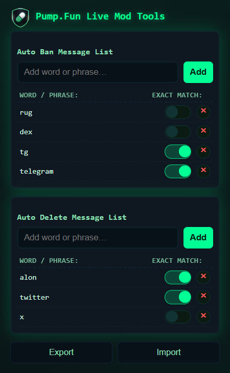
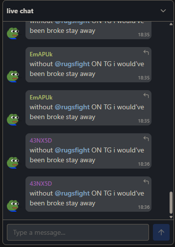

# Pump.Fun Live Mod Tools Chrome Extension

**Advanced filtering and moderation tools to keep your Pump.Fun live streams clean and professional.**

This Chrome extension seamlessly integrates with the Pump.Fun interface to provide powerful, real-time moderation controls, helping you delete spam, ban troublemakers, and maintain quality conversations with ease.

---

## See It In Action

The extension helps you turn a chaotic, spam-filled chat into a clean, moderated environment.

| THIS:                                                                                             | STOPS THIS:                                                                 |
| ------------------------------------------------------------------------------------------------- | --------------------------------------------------------------------------- |
|  |  |

---

## Features

-   **🧠 Smart Filtering**: Automatically filter inappropriate content and spam messages in real-time during live streams.
-   **🗑️ Instant Deletion**: Remove unwanted messages with a single click to maintain a clean chat environment.
-   **🚫 User Management**: Ban problematic users and prevent them from disrupting your live stream conversations.

---

## Installation (Manual)

The extension is currently awaiting approval from the Chrome Web Store. In the meantime, you can install it manually:

1.  **Download:** Download this repository as a ZIP file from the main GitHub page.
2.  **Unzip:** Unpack the downloaded ZIP file to a permanent location on your computer.
3.  **Open Chrome Extensions:** Open Google Chrome and navigate to `chrome://extensions`.
4.  **Enable Developer Mode:** In the top-right corner, toggle on "Developer mode".
5.  **Load the Extension:** Click the "Load unpacked" button that appears and select the folder you unzipped in step 2.
6.  **Done!** The Pump.Fun Live Mod Tools extension should now be active and will appear on the Pump.Fun website.

---

## Roadmap (Coming Soon)

We are actively working on new features to make this tool even more powerful:

-   **🤖 AI Spam Detection**: Advanced AI algorithms to automatically detect and handle complex spam patterns.
-   **🔁 Pattern Blocking**: Automatically block repetitive spam messages and consistent troublemakers.
-   **📊 Advanced Analytics**: Get detailed insights and analytics about your stream's moderation activity.

---

## Disclaimer

This project is not affiliated with Pump.Fun. It is an independent tool developed to enhance the user experience on the platform.

---

## License

This project is licensed under the MIT License.
